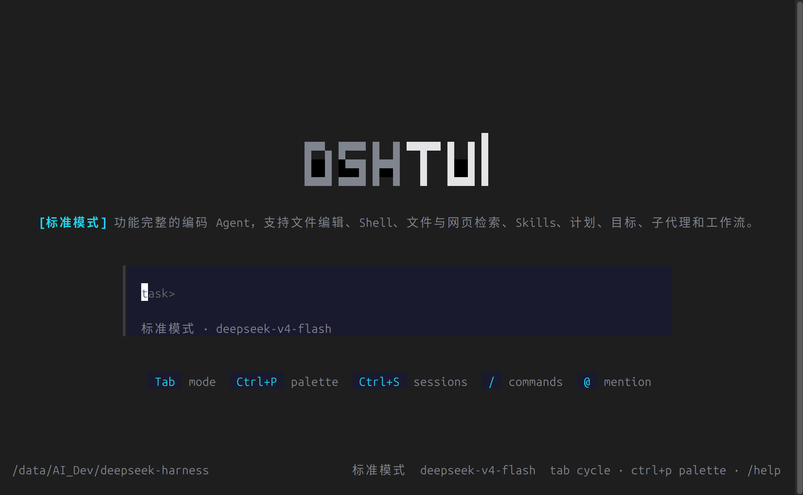

# DSH TUI

English | [中文](README.zh.md)

A terminal UI for [DeepSeek Harness](https://github.com/deepseek-ai/deepseek-harness), the plugin-based agent harness where everything is a plugin. DSH TUI runs the agent loop in-process and renders it with an OpenTUI (SolidJS) interface: streaming markdown, per-tool cards, themes, and work modes.



Features:

- Home and chat pages with streaming markdown replies
- Tool-call cards: terminal, diff, read, search, web
- Slash commands with an autocomplete menu: `/model`, `/mode`, `/theme`, `/sessions`, `/clear`, `/compact`, `/goal`, `/plan`
- `@path` file mentions and `@[session]` cross-session mentions
- Sidebar session list with resume, approval prompts, 33 themes
- Tab-cyclable work modes (standard / code / minimal / cordis) backed by agent presets
- JSONL session persistence under `./.sessions` (override with `DSH_SESSION_ROOT`)

## Download a release

Prebuilt single-file binaries are on [GitHub Releases](https://github.com/papachong/deepseek-harness-tui/releases) — no runtime to install, the executable embeds everything:

| Platform | Asset |
| --- | --- |
| Windows x86-64 | `dsh-tui-windows-x64.exe` |
| macOS Intel | `dsh-tui-macos-x64` |
| macOS Apple Silicon (arm64) | `dsh-tui-macos-arm64` |
| Linux x86-64 (Debian/Ubuntu, `.deb`) | `dsh-tui-linux-x64.deb` |

A one-line online install command is planned for a future release.

Set your [DeepSeek API key](https://platform.deepseek.com) and run the binary with a composition config (copy the default [`packages/bundle/tui/cordis.yml`](packages/bundle/tui/cordis.yml) from this repository):

```sh
# macOS / Linux
export DEEPSEEK_API_KEY=sk-...        # or put it in a .env next to your config
chmod +x ./dsh-tui-macos-arm64
./dsh-tui-macos-arm64 path/to/cordis.yml

# Linux (.deb) installs dsh-tui onto PATH
sudo dpkg -i dsh-tui-linux-x64.deb
dsh-tui path/to/cordis.yml
```

```powershell
# Windows (PowerShell)
$env:DEEPSEEK_API_KEY = "sk-..."
.\dsh-tui-windows-x64.exe path\to\cordis.yml
```

The bin takes the composition config from the first non-empty channel: `$DSH_CORDIS_CONFIG`, then the positional argument. Useful flags and variables:

- `--resume <sessionId>` — rebuild the agent on a persisted session
- `DSH_SESSION_ROOT` — session storage root (default `./.sessions`)
- `DSH_CWD` — working directory for bash and filesystem tools

## Build from source

Requires Node.js ^22.19 or >=24 (build tooling) and [Bun](https://bun.sh) 1.3+ (compiles the Solid view and runs the result — the OpenTUI renderer draws through `bun:ffi`, which Node.js does not provide).

```sh
git clone https://github.com/papachong/deepseek-harness-tui.git
cd deepseek-harness-tui
pnpm install          # needs Node.js ^22.19 or >=24, and Bun for the view build
pnpm run build        # tsc + tsdown bundles; Bun.build compiles the Solid view
cd packages/bundle/tui
echo 'DEEPSEEK_API_KEY=sk-...' > .env
bun lib/bin.js cordis.yml
```

To hack on the interface, the view layer lives in `packages/bundle/tui/src/view/` (SolidJS components, store, themes) and the REPL runner in `src/runner.ts`. Rebuild the view with `pnpm --filter @deepseek-ai/dsh-tui run build:view` and relaunch `bun lib/bin.js`.

To compose your own agent instead of editing the UI, write your own `cordis.yml` — mount different plugins, presets, or models — and point the bin at it. The TUI renders whatever the composition produces.

## Contributing

Issues and pull requests are welcome at [github.com/papachong/deepseek-harness-tui](https://github.com/papachong/deepseek-harness-tui). Before pushing, run the relevant checks (`pnpm run typecheck`, `pnpm run lint`, focused `pnpm run test`); see [AGENTS.md](AGENTS.md) for repository conventions.

## License

[MIT](LICENSE)
